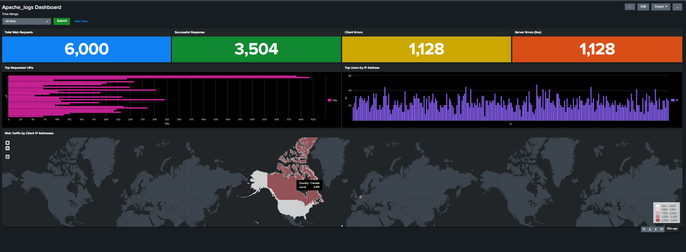

# Splunk Apache Log Analysis Dashboard

This project involved building a comprehensive, real-time monitoring dashboard in Splunk to analyze and visualize JSON-formatted Apache access logs. The goal was to create a "single pane of glass" for both operational monitoring and security analysis, enabling a Security Operations Center (SOC) analyst to instantly understand web traffic patterns and identify potential threats.

---
## The Threat & Operations Dashboard

The final dashboard provides a high-level executive summary combined with granular, actionable insights. It is designed to help an analyst answer key questions:
* What is the overall health of the server? (KPIs)
* Are we under attack or being scanned? (Top URIs, Top IPs)
* Where is this traffic coming from? (GeoIP Map)

*
Figure 1: The final dashboard providing a 360-degree view of Apache web server activity.*

---
## Dashboard & Panel Analysis

Each visualization was built with Splunk's Search Processing Language (SPL) to transform raw JSON logs into actionable intelligence.

### 1. At-a-Glance KPIs (Key Performance Indicators)
These four panels at the top provide an immediate summary of server health.
* **Total Web Requests:** A baseline of all traffic.
* **Successful Responses:** A count of all `HTTP 200` status codes.
* **Client Errors (4xx):** This is a critical security metric. A spike here can indicate a "forced browsing" attack, directory scanning (e.g., `404 Not Found`), or authorization failures (e.g., `403 Forbidden`).
* **Server Errors (5xx):** This is a key operational metric. A spike indicates application-level failures, which could be caused by bad code, a misconfiguration, or an application-layer Denial of Service (DoS) attack.

### 2. Top Attack Indicators
These two bar charts are designed for active threat hunting.
* **Top Requested URIs:** In a real-world scenario, an analyst would use this to spot scanning for common vulnerabilities like `wp-admin.php`, `.env`, or `/.git/config`.
* **Top Users by IP Address:** This panel immediately identifies the "noisiest" clients. An analyst can use this to find the source IP of a brute-force attack, a scanner, or a DoS.

### 3. Geographic Threat Map
This choropleth map uses Splunk's `iplocation` and `geom` commands to visualize the geographic source of all web traffic. This provides instant situational awareness, allowing an analyst to spot anomalies, such as a sudden influx of traffic from a country where the organization does not do business.

---
## 🚀 Skills & Technologies Demonstrated

* **Splunk Enterprise:** Dashboard creation, data ingestion, and panel configuration.
* **Search Processing Language (SPL):** Writing queries using `stats`, `where`, `table`, `iplocation`, and `geom` to analyze and transform data.
* **Log Analysis:** Parsing and interpreting JSON-formatted Apache access logs.
* **Data Visualization:** Designing effective and intuitive dashboards for technical and non-technical audiences.
* **Cybersecurity Monitoring:** Applying dashboarding skills to a real-world security use case (threat hunting, anomaly detection).
